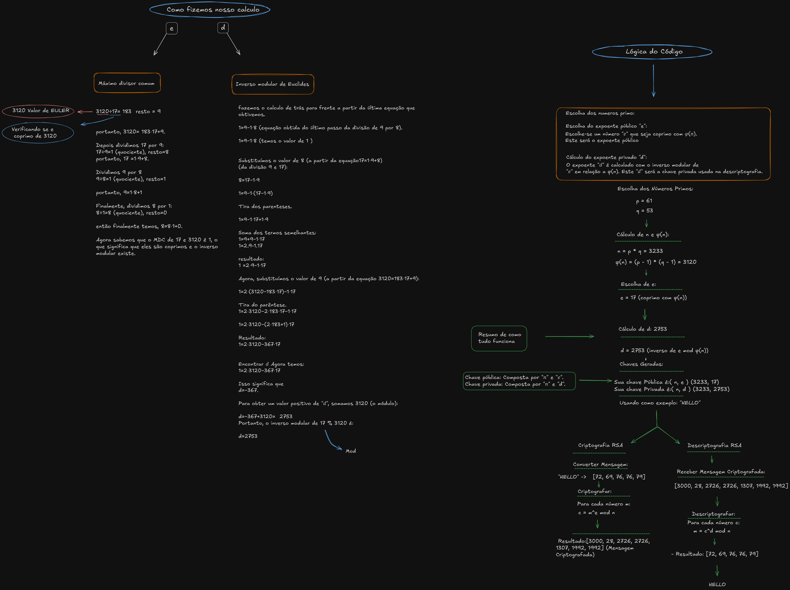

# Projeto de Criptografia e Troca de Mensagens

Este é um projeto desenvolvido em Python com o objetivo de criar um sistema de troca de mensagens criptografadas usando RSA e Firebase. O projeto foi estruturado em dois módulos principais para garantir segurança e praticidade na comunicação.

Este projeto foi desenvolvido como parte do módulo de **Lógica de Programação I** e envolve o uso de algoritmos de criptografia e armazenamento de dados em tempo real para garantir a privacidade das mensagens trocadas.

## Tabela de Conteúdos
- [Descrição](#descrição)
- [Organização do Projeto](#organização-do-projeto)
- [Funcionalidades](#funcionalidades)
- [Metodologia](#metodologia)
- [Instalação](#instalação)

---

## Descrição

O Projeto de Criptografia e Troca de Mensagens permite que dois usuários troquem mensagens de forma segura usando criptografia RSA e Firebase para armazenamento dos dados. O sistema converte mensagens em texto para uma representação hexadecimal criptografada e, em seguida, armazena no banco de dados Firebase, garantindo que apenas os destinatários com a chave privada possam descriptografar a mensagem.

O projeto é dividido em duas partes principais:
1. **Troca de Chaves Diffie-Hellman (logica de DH.py)**: Implementa o protocolo Diffie-Hellman como uma introdução ao funcionamento da criptografia, usadi para entender compreensão prática do processo de troca de chaves entre duas partes.
2. **Criptografia RSA e Firebase (Projeto Completo.py)**: Gerencia a criptografia e descriptografia de mensagens com Firebase para o armazenamento das mensagens.

---

## Organização do Projeto

O projeto foi organizado em módulos para facilitar o fluxo de trabalho e manter uma estrutura intuitiva:

- **Projeto Completo.py**: 
  - Integra o Firebase para armazenamento de mensagens.
  - Implementa a criptografia RSA para transformar mensagens em texto em uma forma segura para transmissão.
  - Cria uma interface de linha de comando para o usuário enviar e receber mensagens criptografadas.

---

## Funcionalidades

O projeto inclui diversas funcionalidades que permitem a troca segura de mensagens e gerenciamento de dados:

- **Criptografia RSA**: Converte mensagens em números criptografados que podem ser armazenados com segurança.
- **Descriptografia**: Restaura a mensagem original usando a chave privada do destinatário.
- **Armazenamento no Firebase**: Salva e recupera mensagens no Realtime Database do Firebase.
- **Painel de Controle Simplificado**: Oferece uma interface de linha de comando para fácil navegação e execução de operações, como enviar, recuperar e apagar mensagens.

---

## Metodologia

Para o planejamento do projeto, utilizamos o Excalidraw para mapear as funcionalidades e a lógica do sistema. Isso incluiu a estruturação das etapas do projeto e as dependências entre módulos. Os principais passos da metodologia foram:



1. **Definição de Objetivos**: Estabelecemos a necessidade de uma comunicação segura e armazenada remotamente.
2. **Divisão dos Módulos**: Identificamos as principais funcionalidades e dividimos o projeto em módulos (Troca de Chaves, Criptografia, Banco de Dados).
3. **Estrutura do Painel de Controle**: Planejamos uma interface de linha de comando intuitiva para facilitar o uso do sistema.
4. **Testes e Validação**: Testamos as funções individualmente para garantir a correta integração entre criptografia, armazenamento e interface.

Este mapeamento ajudou a implementar todas as funcionalidades de forma clara e prática, assegurando que o sistema atendesse aos requisitos de segurança e praticidade.

---

## Instalação

Para executar o projeto, siga estas instruções:

1. **Instale as dependências**:
   - Certifique-se de ter o Python 3.8 ou superior instalado.
   - Instale o Firebase SDK com o seguinte comando:
     ```bash
     pip install firebase-admin
     ```
2. **Configuração do Firebase**:
   - Coloque o arquivo JSON com as credenciais do Firebase na mesma pasta dos scripts e renomeie para `chave_firebase.json`.

3. **Execução**:
   - Inicie o arquivo `Projeto Completo.py` e siga as instruções da interface de linha de comando para enviar, recuperar e gerenciar mensagens criptografadas.

--- 

Este projeto exemplifica o uso de algoritmos de criptografia e armazenamento em tempo real, com o Diffie-Hellman como introdução para compreensão dos princípios de criptografia, e pode ser expandido para diversas outras aplicações de troca segura de informações.
